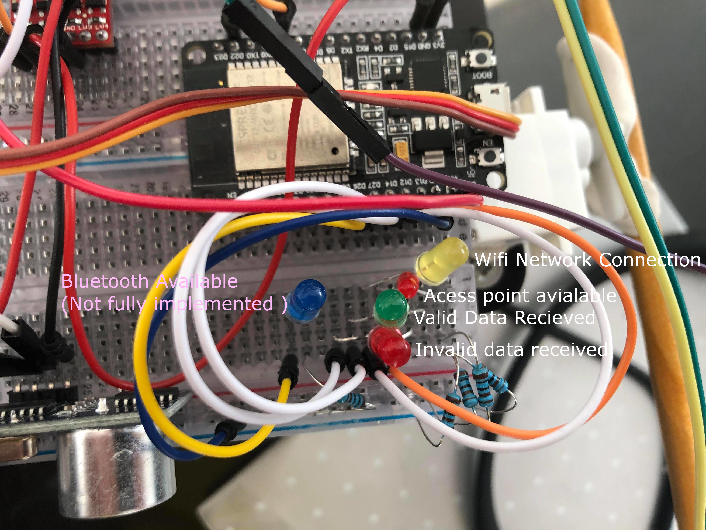
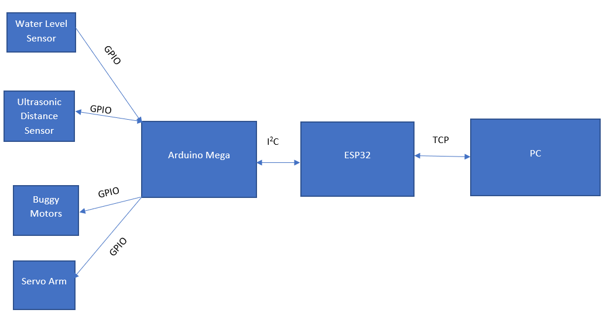
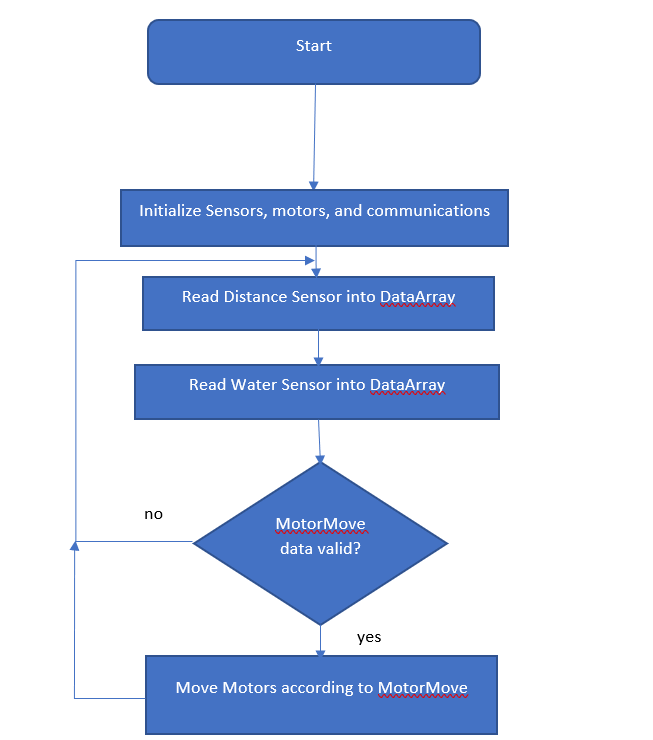
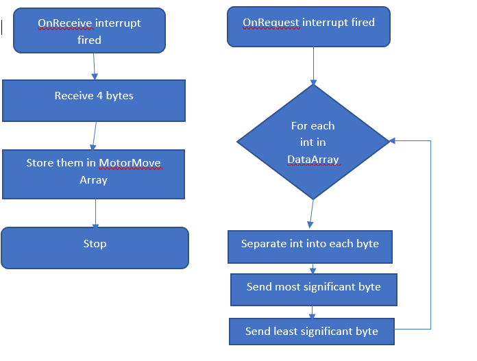

SOFT564z
========

Summary
-------

The purpose of this project was to create a distributed solution for the remote
monitoring of hydroponic plants, or other water-level dependent systems. In
order to achieve this, the system was designed to be robust and user-friendly.
This report will document the Design, Implementation, and Testing, then evaluate
the success of the Final product. The source code, and instructions for
implementation are available in this [git
repository](https://github.com/noblegasses/SOFT564z.git).

Design
------

The goal of this project is to produce a teleoperated robot for application of
remote monitoring of hydroponic plants. It is equipped with an ultrasonic sensor
for obstacle avoidance, and a water level sensor for water level monitoring.

This uses an Arduino Mega as a control platform. This device controls the motors
of the buggy, and Servo arm for the water sensor. Additionally, the Mega
measures and processes the data from the sensors. The distance sensor is used
for measuring the distance from the target for water level measurement, and the
water level sensor is used to detect the water level of the target, to detect if
the system needs to be filled or emptied.

An ESP32 is used as the communication hub for the system, either connecting to a
specific WiFi network, or if that is unavailable, hosting it’s own, short range
access point. The ESP32 requests sensor data from the arduino and transmits it
to the user’s PC, as well as receiving movement commands from the PC and
transmitting it to the arduino. The ESP also has a set of LED’s that is used to
communicate the status of the system (see fig 1).

}

Figure 1. Image of ESP32 Status LED’s and their purposes

The PC hosts a Graphical user interface that displays the read in data, as well
as the servo’s current position and the controls for the robot. By pressing the
WASD key, the user can control the robot’s movement, and by pressing V and F,
lower and raise the servo arm for the water level sensor.

Figure 2. High level system overview

Implementation
--------------

This section will explain how data is processed and handled for each part of the
system. This will overview each of the systems and communication protocols for
each device from a low level standpoint. Starting with the Arduino, followed by
the ESP32 and I2C communication, and finally the PC client and TCP communication
it uses.

 

The Arduino Mega board is responsible for the measurement of sensors, and the
movement of the motors of the device. The Arduino is connected to the HC-SR04
Ultrasonic distance sensor via the echo pin on GPIO digital 6, trigger pin on
GPIO digital 5. The trigger pin is used to start a sample on the ultrasonic
sensor, and the echo pin is used to read the data from that sample into the
Arduino. Once the sample is read in as a PWM signal, it has to be translated
from a travel time from and to the sensor into a distance from the sensor to the
object. This is achieved by multiplying the travel time by the speed of sound,
scaled to us, and dividing the result by 2 to have only the distance to the
device. The water level sensor gives an analog reading, and is connected via the
analog 1 pin. The data read in is not very useful. The Arduino map function
allows the data to be scaled from the upper and lower limits to the length of
the water sensor, giving a depth in millimeters.

 

The motors are controlled by the Arduino as well. The Arduino moves both the
motor gearboxes for the buggy, and the servo that is used to raise and lower the
water level sensor. The data for motor movement is stored in a single char array
called MotorMove. The first character of the array expected as one of either ‘F’
(forwards), ‘B’ (Backwards), ‘R’ (Right), ‘L’ (left), or ‘S’ (stop). If an
unexpected character is read in, the system will stop moving otherwise the
motors will be set to begin movement in the desired direction. The final 3
characters of the array are numbers that give a servo position. These characters
are converted into an integer value and move the servo to the given position
using the [Servo.h
library](https://www.arduino.cc/reference/en/libraries/servo/).

Figure 3. Arduino non-interrupt main loop

The Arduino is constantly sampling the two sensors and storing them in a
volatile dataArray to be used for communication as needed. Since the I2C slave
code is entirely interrupt driven, the Arduino can update data and move the
motors until ready. I2C is implemented through the [Arduino
Wire.h](https://www.arduino.cc/en/reference/wire) library, and although not used
currently, the [LiquidCrystal_I2C.h
library](https://www.arduino.cc/reference/en/libraries/liquidcrystal-i2c/) is
available to write messages and errors to the LCD display. The Arduino I2C
library offers 2 interrupts for ISR’s to be attached to for an I2C slave. The
onRequest interrupt fires if the master device requests a number of bits from
the slave. The ISR I have implemented for the onRequest interrupt sends the
contents of the dataArray array in bytes. Since the mega stores integers in 2
bytes, each integer must be split up in order to send the data over I2C. The
onReceive interrupt is triggered when the master has data to send to the slave
device, it passes an argument to the ISR, this argument contains the number of
bytes being sent over. The ISR I have implemented reads in 4 bytes from the
master device and stores them as chars in the MotoMove array.

The ESP32 is the networking hub for the system, it hosts a TCP server to
communicate with a PC, and acts as an I2C master to communicate to the Arduino.
On setup, the ESP32 attempt to connect to a Wifi network. it attempts this 5
times, if this fails, it host it’s own access point called espWifi, with the
password “ShortRange”. This is intended as a short range work around if the
intended network is not available. All WiFi connection and communication is done
via the [Wifi.h library​​​](https://www.arduino.cc/en/Reference/).

The

Testing
-------

Evaluation
----------

 

### Video Demonstration link

 

### Git Repo Link

<https://github.com/noblegasses/SOFT564z.git>
